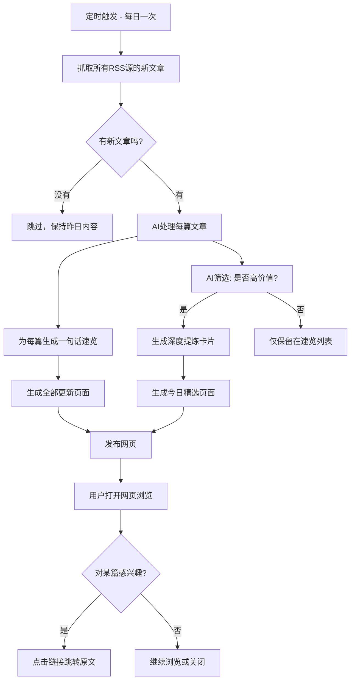

# AI每日前沿 - 需求文档

## 概述
- **一句话描述**：自动抓取AI领域头部英文RSS博客，用AI提炼核心内容，生成每日可浏览的网页，帮助用户在2分钟内掌握AI领域最新高价值动态。
- **技术栈**：待定（建议 Python 抓取 + LLM API 处理 + 静态网页生成，部署方式后续确认）
- **MVP范围**：只做RSS抓取+AI处理+网页展示；不做小红书内容生成、不做X/Newsletter抓取、不做邮件/飞书推送

## 信息源（第一版 RSS 列表）

以下为经过连通性验证的订阅源，聚焦AI领域，共20个（2026-02-24 更新）：

# === AI实验室 ===
  "OpenAI News": "https://openai.com/news/rss.xml", # 官方 RSS（已验证可用）
  "Google DeepMind": "https://deepmind.google/blog/rss.xml",
  "Mistral AI": "https://raw.githubusercontent.com/0xSMW/rss-feeds/main/feeds/feed_mistral_news.xml", # 社区维护的抓取源

  # === AI工具与开发者向 ===
  "Hugging Face": "https://huggingface.co/blog/feed.xml",
  "LangChain": "https://blog.langchain.dev/rss/",

  # === AI实践派个人博客 ===
  "Simon Willison": "https://simonwillison.net/atom/everything", # 质量极高，通常提供全文
  "Eugene Yan": "https://eugeneyan.com/rss/", # 提供全文
  "Lilian Weng": "https://lilianweng.github.io/index.xml",
  "Chip Huyen": "https://huyenchip.com/feed.xml",
  "Jay Alammar": "https://jalammar.github.io/feed.xml",
  "Sebastian Raschka": "https://magazine.sebastianraschka.com/feed", # Substack 源，可能只有摘要

  # === AI行业媒体与全景扫描 ===
  "MIT Tech Review AI": "https://www.technologyreview.com/feed/",
  "The Verge AI": "https://www.theverge.com/rss/ai-artificial-intelligence/index.xml",
  "Ars Technica AI": "https://feeds.arstechnica.com/arstechnica/technology-lab",
  "The Gradient": "https://thegradient.pub/rss/",
  "Ben's Bites": "https://www.bensbites.com/feed"

  # === AI Newsletter ===
  "The Keyword (Google AI)": "https://blog.google/technology/ai/rss/", # Google AI 官方博客
  "AINews by smol.ai": "https://news.smol.ai/rss.xml", # AI工程师向，每日汇总
  "Peter Yang": "https://creatoreconomy.so/feed", # AI技能提升，适合PM
  "Every (Chain of Thought)": "https://every.to/chain-of-thought/feed", # AI时代深度思考

> **已移除的源（2026-02-24，无可用 RSS）：**
> - Anthropic Blog：官方无 RSS，社区源已停更
> - Meta AI：返回 HTTP 400，官方无公开 RSS
> - LlamaIndex：RSS 地址已失效(404)，Medium 替代源也不可用
> - Ollama：官方未提供 RSS
> - The Batch (吴恩达)：deeplearning.ai 已不提供 RSS feed
> - AI Valley：所有候选 RSS 地址均无有效条目
>
> 注意：以上 RSS 地址已于 2026-02-24 逐一验证可用性。
> 后续优化：用两周后人工校验是否有重要信息遗漏，针对性增减源。

## 核心流程



## AI筛选标准

AI判断一篇文章是否进入"今日精选"时，依据以下三个条件（需同时满足至少两个）：
1. **有新东西**：发布了新模型、新工具、新方法、新研究成果，而非旧闻换皮
2. **跟实践相关**：读完后能改变读者做某件事的方式（新技巧、新工具用法、新工作流）
3. **有深度**：原文信息量足够丰富，值得花3分钟以上阅读，而非一段话就能说完的简短公告

## 用户故事

### US-01: 查看今日精选

**描述**：作为用户，我想打开网页看到AI筛选出的当日最值得看的3-5篇文章的深度提炼，以便在2分钟内掌握今天最有价值的AI动态。

**优先级**：P0

**详细说明**：
- 页面顶部显示日期
- 展示3-5张文章卡片，每张卡片包含：
  - 文章标题（可点击，跳转原文）
  - 来源博客名称
  - **核心内容**：2-3句话概括这篇文章讲了什么
  - **你可以学到**：1-2句话说明这篇文章对读者的价值
  - **行动建议**：1句话说明读完后可以做什么（如"可以试试XX工具"、"值得关注XX趋势"）
- 如果当日没有符合精选标准的文章，显示"今日暂无高价值精选，可查看全部更新"
- 页面上有明显入口可以跳转到"全部更新"页面
- 可以切换查看最近7天的历史精选（每天一期）

**页面草图**：

```
┌──────────────────────────────────────────────┐
│  🤖 AI每日前沿                                │
│  [今日精选]  [全部更新]        ← 两个tab切换    │
├──────────────────────────────────────────────┤
│                                              │
│  📅 2026-02-24    [<前一天]  [后一天>]         │
│                                              │
│  ┌──────────────────────────────────────┐    │
│  │ 📌 OpenAI发布GPT-5 Turbo：速度快3倍    │    │
│  │ 来源：OpenAI Blog                     │    │
│  │                                      │    │
│  │ 核心内容：OpenAI发布了GPT-5 Turbo，    │    │
│  │ 推理速度提升3倍，价格降低50%，支持...    │    │
│  │                                      │    │
│  │ 💡 你可以学到：新模型在代码生成和       │    │
│  │ 长文本处理上有显著提升，适合...          │    │
│  │                                      │    │
│  │ 🎯 行动建议：如果你在用GPT-4做开发，   │    │
│  │ 值得切换测试一下性价比                  │    │
│  │                                      │    │
│  │                        [阅读原文 →]   │    │
│  └──────────────────────────────────────┘    │
│                                              │
│  ┌──────────────────────────────────────┐    │
│  │ 📌 （第二篇精选卡片，同上结构）         │    │
│  └──────────────────────────────────────┘    │
│                                              │
│  ...（共3-5篇）                               │
│                                              │
└──────────────────────────────────────────────┘
```

**验收标准**：
- [ ] 页面正确显示当日日期和精选文章卡片
- [ ] 每张卡片包含标题、来源、核心内容、学到什么、行动建议五个部分
- [ ] 点击文章标题或"阅读原文"可在新标签页打开原文
- [ ] 当日无精选时显示空状态提示
- [ ] 可以通过日期切换查看最近7天的内容
- [ ] 可以跳转到"全部更新"页面

---

### US-02: 查看全部更新速览

**描述**：作为用户，我想看到今天所有RSS源的更新列表，以便快速扫一眼确认没有遗漏感兴趣的内容。

**优先级**：P0

**详细说明**：
- 展示当日所有抓取到的文章，按时间倒序排列
- 每篇文章显示：
  - 文章标题（可点击，跳转原文）
  - 来源博客名称
  - 一句话速览（AI生成，不超过30字，说清楚文章核心讲了什么）
- 已进入"今日精选"的文章做个标记（如加个🔥），方便用户识别
- 页面上有明显入口可以跳转回"今日精选"页面
- 同样支持查看最近7天的历史

**页面草图**：

```
┌──────────────────────────────────────────────┐
│  🤖 AI每日前沿                                │
│  [今日精选]  [全部更新]        ← 两个tab切换    │
├──────────────────────────────────────────────┤
│                                              │
│  📅 2026-02-24    [<前一天]  [后一天>]         │
│  共 18 篇更新                                 │
│                                              │
│  🔥 OpenAI发布GPT-5 Turbo：速度快3倍          │
│     OpenAI Blog · 新模型推理速度3倍且降价50%    │
│                                              │
│  🔥 Simon Willison实测Claude新工具链           │
│     Simon Willison · 对比测试三种AI编程工作流   │
│                                              │
│  ○ Hugging Face开源新版Tokenizer              │
│     Hugging Face Blog · 新分词器速度提升但...   │
│                                              │
│  ○ MIT发布2026 AI行业薪资报告                  │
│     MIT Tech Review · 调研2000+从业者薪资...    │
│                                              │
│  ...（更多条目）                               │
│                                              │
└──────────────────────────────────────────────┘
```

**验收标准**：
- [ ] 页面展示当日所有抓取到的文章
- [ ] 每条包含标题、来源、一句话速览
- [ ] 点击标题可在新标签页打开原文
- [ ] 精选文章有🔥标记区分
- [ ] 按时间倒序排列
- [ ] 支持查看最近7天历史

---

### US-03: RSS自动抓取与AI处理

**描述**：作为系统，需要每天定时自动抓取所有RSS源的新文章，调用AI进行内容处理，并生成网页文件。

**优先级**：P0

**详细说明**：
- 每天定时执行一次（建议北京时间早上7:00，抓取前24小时的更新）
- 遍历所有RSS源，提取新发布的文章（根据发布时间去重，避免重复处理）
- 对每篇新文章，调用LLM进行处理：
  - 生成一句话速览（不超过30字）
  - 判断是否符合精选标准（输出"是/否"及理由）
  - 如果是精选：生成核心内容、学到什么、行动建议
- 处理完成后生成静态网页文件
- 保留最近7天的数据，超过7天的自动清理

**边界和异常处理**：
- 某个RSS源抓取失败（网络超时、源地址变更）：跳过该源，记录错误日志，不影响其他源
- AI处理某篇文章失败：该文章仍然出现在"全部更新"中，但一句话速览显示"AI处理失败，请直接查看原文"
- 当日完全无更新：保留页面，显示"今日暂无更新"
- 文章内容为非英文：跳过，不处理

**验收标准**：
- [ ] 定时任务每日自动执行，无需人工触发
- [ ] 成功抓取各RSS源的新文章（根据发布时间判断新旧）
- [ ] 每篇文章都有一句话速览
- [ ] 精选文章有完整的深度提炼内容
- [ ] 单个RSS源故障不影响整体运行
- [ ] 7天前的数据被自动清理

---

## 注意事项
- **必须正确**：精选文章的"核心内容"提炼必须准确反映原文，不能出现AI幻觉或张冠李戴；原文链接必须可以正确跳转
- **可以先凑合**：页面样式第一版简洁能用就行，不追求好看；AI筛选标准可能不够精准，后续根据体验调整；RSS地址可能需要手动校验和更新
- **已知风险**：
  1. 部分RSS源可能只输出摘要而非全文，AI提炼质量会受影响 → 应对：对这类源尝试抓取原文页面，失败则基于摘要处理并标注"基于摘要提炼"
  2. 15-20个源可能遗漏重要信息 → 应对：上线两周后人工校验一次，对比X/即刻热点，针对性增减源
  3. LLM API调用有成本 → 应对：控制每日处理文章数量上限（如50篇），超出部分只生成速览不做深度提炼
